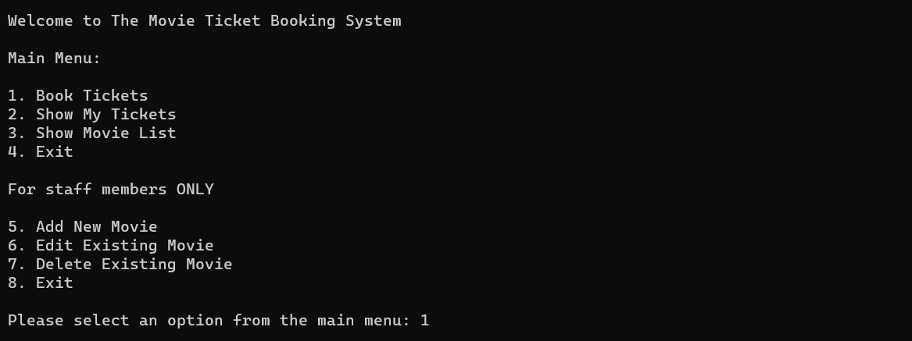
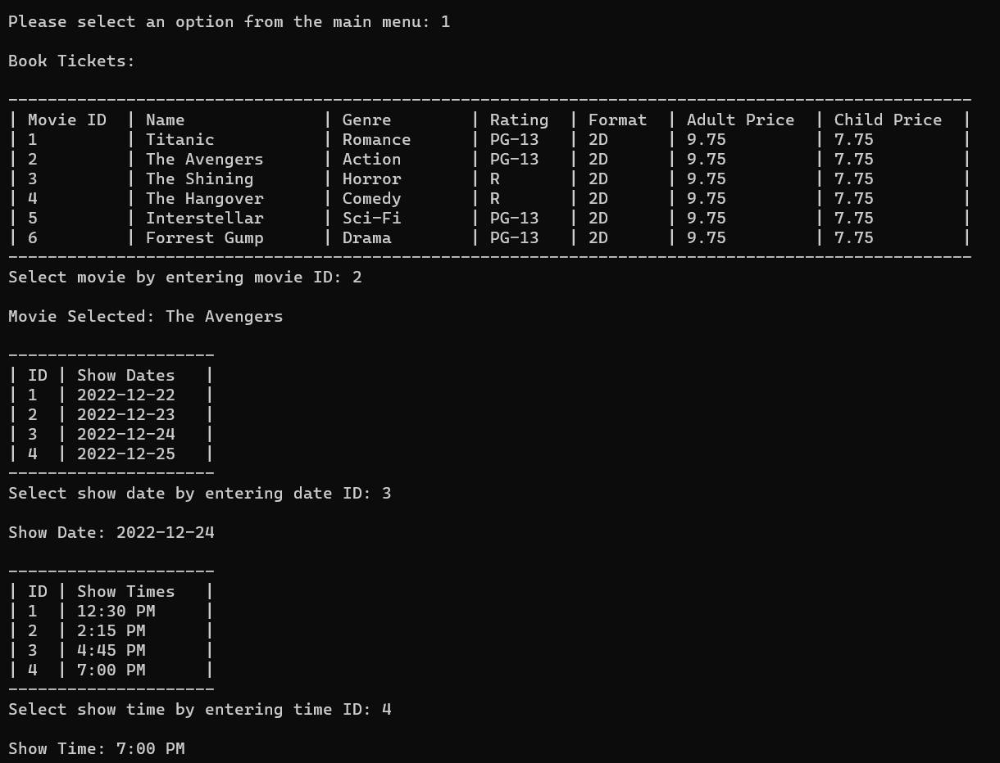
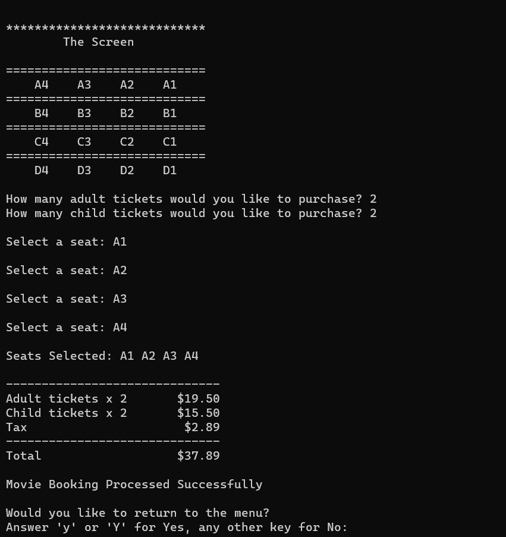
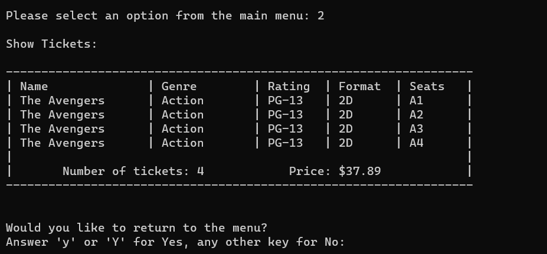
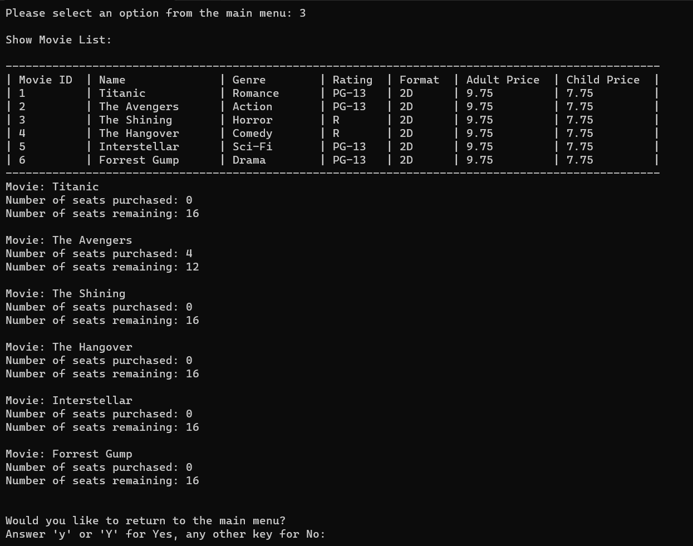

# MovieTicketBooking
MovieTicketBooking is a C++ application that allows users to select from a list of movies and simplifies the movie ticket booking process.

## How To Compile & Run

- Compile: `g++ -I ./ *.cpp -o booking`
- Run: `./booking`

## What I Learned
- Implementing classes and functions in an object-based program
- Allocation and deallocation of pointers
- Separating interface from implementation
- Validating input and formatting output

## How It Works
- After running the application, a menu is displayed that presents a list of movies
- The user is provided the option to select a movie, show their purchased tickets, or show the list of movies currently playing
- If the user is a staff member, they can add a new movie or edit and delete an existing movie from the movie list   
  
- Booking movie tickets allows the user to select their movie of choice, select a date and time for their movie, and select their seating arrangement
- If the user inputs an ID number or seat that is out of range, an error message will print and the user will be prompted to re-enter their selection
  
  
  
- The Show My Tickets menu option will present the user's movie tickets, which includes the number of tickets purchased, their seat selection and total price 
  
  
- The Show Movie List menu option will present movie details and seat availability 
  
  

## Limitations
- There is a runtime error when the Movie class destructor is not commented out.
- As of this time, some of the staff member options need to be further expanded upon, including adding a new movie or deleting an existing movie from the movie list.
- Last Revised: 12/2022